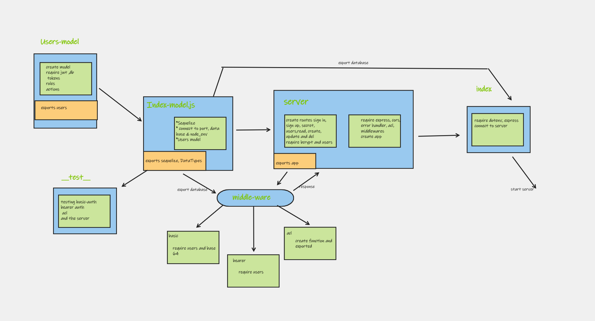

# auth-api
Authentication Server Phase 3: Role Based Access Control  Being able to login is great. But controlling access at a more granular level is vital to creating a scalable system. In this lab, you will implement Role Based Access Control (RBAC) using an Access Control List (ACL), allowing to not only restrict access to routes for valid users, but also based on the individual permissions we give each user.

## UML diagram

## **here are the links for the server:**

**1. The Actions link:**
   [Actions](https://github.com/marah-jaradat/auth-api/actions)

**2. The Pull request:**
   [pull request](https://github.com/marah-jaradat/auth-api/pulls)

**3. Heroku link**
    [deploy-main](https://auth-api-mara.herokuapp.com/)